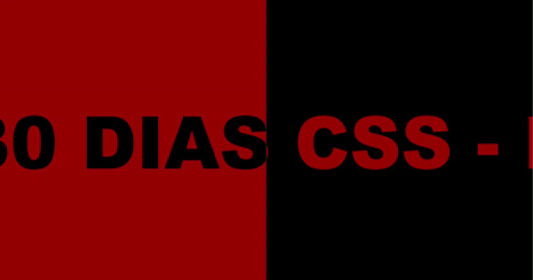

# 30diasCSS
Olá devs! O desafio de 30 dias de CSS é a parte 1 de 3 desafios que estarei fazendo para melhorar minhas habilidades front-end.
Serão 30 dias de pequenos projetos utilizando HTML e CSS e a cada 5 dias após o inicio do desafio irei fazer um projeto maior utilizando todos os mini projetos já postados.

# Objetivo 
O objetivo principal do desafio é não só melhorar minhas habilidades como também aprender coisas novas.

# Regras 
* Fazer um desafio por dia.
* Fazer um post no Linkedin a cada progresso.
* Postar até as 23:59.

# Inspiração
Esse projeto foi inspirado no desafio da Milena Carecho e irei utilizar a hashtag #30diasDeCSS que ela disponibilizou no projeto dela.

# Duração
O meu desafio terá inicio dia 10/02/2023 e fim dia 11/03/2023.

* [Dia 01 - Ícone de mídia social animado](id01)
* [Dia 02 - Loader animado](id02)
* [Dia 03 - Mudança da cor do texto quando entra em outra div](id03)
* [Dia 04 - Efeito Hover](id04)
* [Dia 05 - Efeito Pulsar](id05)
* [Dia 06 -  Lighting Text](id06)
* [Dia 07 - Preloader animado](id07)
* [Dia 08 - Coração Pulsante](id08)

# Dia 01 - Ícone de midia social animado 

[Post no Linkedin](https://www.linkedin.com/feed/update/urn:li:activity:7030007461369516033/)

#### O que eu aprendi:
* Manipular div
* Animação com hover
* Introduzir icons por link

# Dia 02 - Loader animado 

[Post no Linkedin](https://www.linkedin.com/feed/update/urn:li:activity:7030308791044706304/)

#### O que eu aprendi:
* Animação com keyframes
* Transições
* nth-of-type

# Dia 03 - Mudança da cor do texto quando entra em outra div 

[Post no Linkedin](https://www.linkedin.com/feed/update/urn:li:activity:7030713053704765440/)

#### O que eu aprendi:
* Transições
* Animações
* Uso de Div

# Dia 04 - Efeito Hover 

[Post no Linkedin](https://www.linkedin.com/posts/victoriagui_30diasdecss-css-frontend-activity-7031051170114592768-QWNZ?utm_source=share&utm_medium=member_desktop)

#### O que eu aprendi:
* Mais do Keyframes
* Animação com luzes
* Transparencia

# Dia 05 - Efeito Pulsar 

[Post no Linkedin](https://www.linkedin.com/posts/victoriagui_30diasdecss-activity-7031406937753686016-Ekjc?utm_source=share&utm_medium=member_desktop)

#### O que eu aprendi:
* Before
* After

# Dia 06 -  Lighting Text 

[Post no Linkedin](https://www.linkedin.com/posts/victoriagui_30diasdecss-css-html-activity-7031787750911553536-zVYK?utm_source=share&utm_medium=member_desktop)

#### O que eu aprendi:
* Utilizar nth-child na ul
* Melhor entendimento do animation-delay

# Dia 07 - Preloader animado 

[Post no Linkedin](https://www.linkedin.com/posts/victoriagui_30diasdecss-html5-css-activity-7032143181366312960-_kPW?utm_source=share&utm_medium=member_desktop)

#### O que eu aprendi:
* Manipular div e container
* Criar elemento no CSS a partir da div

# Dia 08 - Coração Pulsante <a name='id08'><a/name>

[Post no Linkedin](https://www.linkedin.com/feed/update/urn:li:activity:7032405901231763456/)

#### O que aprendi:
* Usar keyframes combinado com o after
* Melhor uso do keyframes
